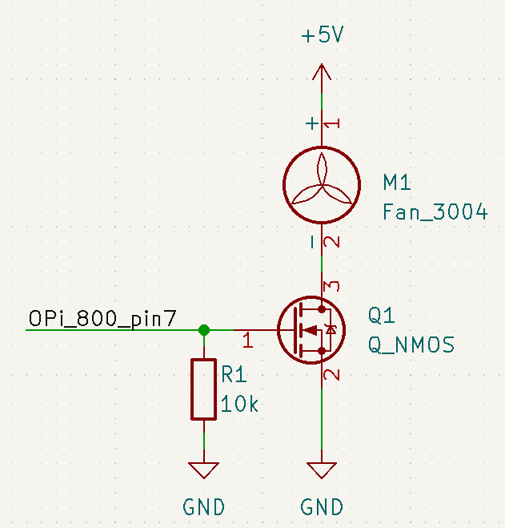
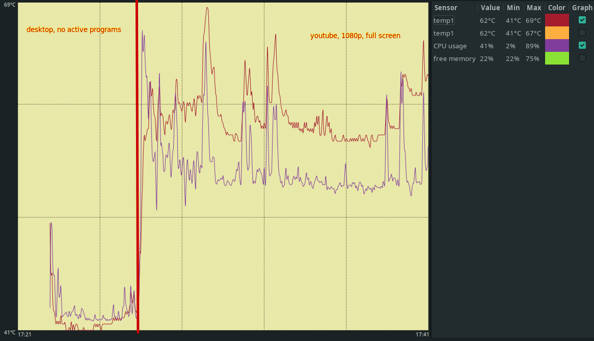
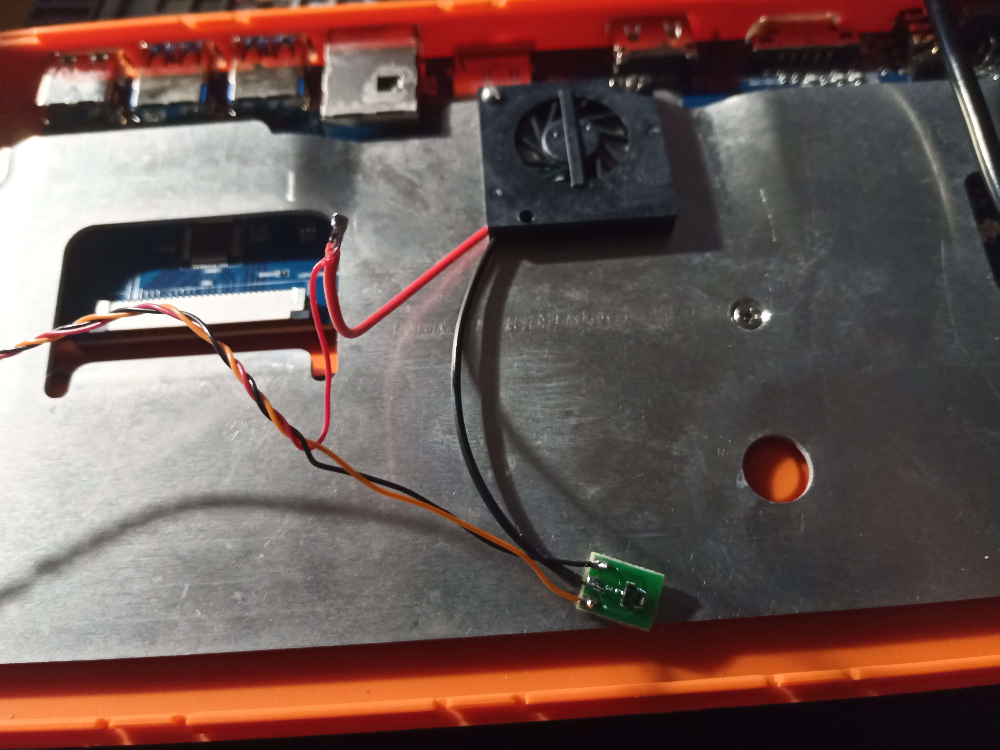

### Readme
Active cooling for Orange Pi 800. The fan was purchased [here](https://aliexpress.ru/item/1005002440430011.html).  

### Scheme  
  

### Script install  
1. Install base-devel if needed:  
    sudo pacman -S base-devel  
2. Install wiringOP:  
    git clone https://github.com/orangepi-xunlong/wiringOP.git
    cd wiringOP
    sudo ./build clean
    sudo ./build
3. Check temper path in pwm_cooler.cpp (line 34), default (return temp * 1000 in Celsius):  
    cat /sys/devices/virtual/thermal/thermal_zone0/temp  
4. Compile script:  
    g++ pwm_cooler.cpp -lwiringPi -o pwm_cooler  
5. Create autostart if needed.  

### Test  
Play 1080p video on YouTube.   
  

### Process  

  
  
  
